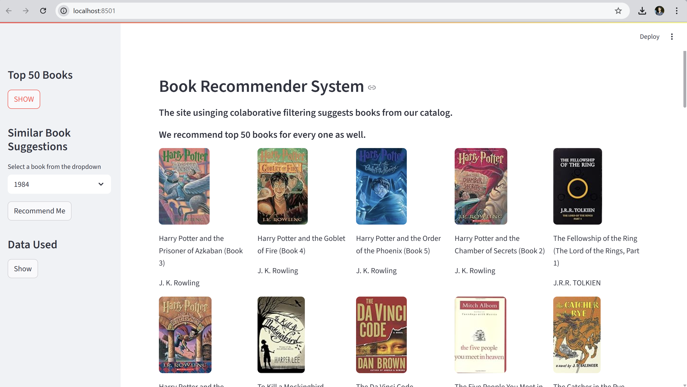

# 📚 Personalized Book Recommender System

A **Streamlit-based web application** that provides **personalized book recommendations** using collaborative filtering.  
Users can explore the **Top 50 popular books**, get **book suggestions based on selected titles**, and even view the underlying dataset.

<p align="center">  
    
</p>

---

## 🚀 Features

- 📖 **Top 50 Books** – Quickly explore the most popular books among users  
- 🔍 **Personalized Recommendations** – Select a book and get similar book suggestions  
- 🧠 **Collaborative Filtering** – Uses user-item interactions for generating recommendations  
- 🖥️ **Interactive Web Interface** – Built using **Streamlit** for a smooth and minimal UI  
- 📊 **Dataset Preview** – Easily browse through the books, ratings, and user information  

---

## 🗂️ Project Structure

```
Personalized Book Recommender/
│
├── app.py                    # Main Streamlit application
├── books.pkl                 # Pickled book metadata
├── popular.pkl               # Top 50 most popular books
├── pt.pkl                    # Pivot table used for recommendations
├── similarity_scores.pkl     # Precomputed similarity matrix
│
├── Code-3_page.py            # Experimental Streamlit version
├── code.py                   # Helper script for backend functions
├── Recommender.ipynb         # Notebook for building and testing the model
├── Final_code b2.ipynb       # Final version of the Jupyter Notebook
│
├── Data/
│   ├── Books.csv             # Book metadata
│   ├── Ratings.csv           # User ratings
│   └── Users.csv             # User demographics
│
├── Data Dictionary.md        # Explanation of each dataset column
├── notes.md                  # Developer notes and observations
├── slides.md                 # Project presentation slides
└── README.md                 # Documentation file
```

---

## ⚙️ Installation

### 1️⃣ Clone the Repository

```bash
git clone https://github.com/KathirvelKannan70/personalized-book-recommender.git
cd personalized-book-recommender
```

### 2️⃣ Install Dependencies

If `requirements.txt` is available:

```bash
python -m pip install -r requirements.txt
```

Or install manually:

```bash
python -m pip install streamlit pandas numpy pickle-mixin
```

---

## ▶️ Usage

To run the app locally:

```bash
cd "C:\Personalized Book Recommender"
streamlit run app.py
```

Then open your browser and navigate to:  
👉 [http://localhost:8501](http://localhost:8501)

---

## 📊 Dataset Details

- **Books.csv** – Book metadata: ISBN, title, author, publisher, year  
- **Ratings.csv** – Ratings provided by users for each book  
- **Users.csv** – User demographic details like location and age  
- **Pickle Files (.pkl)** – Preprocessed data for faster recommendations  

---

## 🧠 How It Works

- **Collaborative Filtering** – Recommends books based on similar users’ preferences  
- **Cosine Similarity** – Measures similarity between book vectors using pivoted ratings  
- **Streamlit** – Lightweight, interactive web framework for building ML dashboards  

---

## 👨‍💻 Author

**Kathirvel Kannan**  
M.Tech in Software Engineering  
Project for Academic Demonstration
